# ERP Project Genome & Architecture Blueprint
**تاريخ الاستخراج:** 2026-10-03 12:49:18
**مسار المشروع:** C:\Users\Taw\Downloads\Compressed\q\ME-main
> **توجيه للوكيل:** هذا الملف يمثل خريطة وهيكل النظام فقط. التزم بقراءته دون طلب فحص الملفات الأصلية إلا للضرورة القصوى.
---
## 1. شجرة مجلدات المشروع (Directory Structure)
```text
  |-- .agents/
  |-- .husky/
  |-- .semgrep/
  |-- admin-dashboard/
  |-- backend/
  |-- backup/
  |-- desktop/
  |-- docs/
  |-- logs/
  |-- packages/
  |-- public/
  |-- scripts/
  |-- src/
  |-- tests/
    |-- skills/
      |-- jev-core/
    |-- public/
    |-- src/
      |-- lib/
      |-- pages/
    |-- deploy/
    |-- scripts/
    |-- src/
    |-- tests/
      |-- nginx/
      |-- application/
      |-- domain/
      |-- infrastructure/
      |-- presentation/
      |-- scripts/
        |-- ports/
        |-- use-cases/
          |-- cashbox/
          |-- dashboard/
          |-- expenses/
          |-- inventory/
          |-- invitation/
          |-- invoices/
          |-- ledger/
          |-- license/
          |-- notifications/
          |-- orders/
          |-- parties/
          |-- printing/
          |-- profit/
          |-- returns/
          |-- settings/
          |-- setup/
          |-- statements/
          |-- super-admin/
          |-- sync/
          |-- vouchers/
        |-- entities/
        |-- errors/
        |-- invoices/
        |-- licensing/
        |-- sync/
        |-- types/
        |-- value-objects/
        |-- audit/
        |-- auth/
        |-- backup/
        |-- config/
        |-- device/
        |-- di/
        |-- errors/
        |-- fingerprint/
        |-- fx/
        |-- http/
        |-- installation/
        |-- integrity/
        |-- license/
        |-- orm/
        |-- repositories/
        |-- repository/
        |-- secrets/
        |-- utils/
          |-- middleware/
          |-- migrations/
          |-- rls/
          |-- schemas/
            |-- meta/
        |-- routes/
        |-- types/
      |-- _helpers/
    |-- pgdump-staging/
    |-- scripts/
    |-- shell/
    |-- src-tauri/
      |-- capabilities/
      |-- gen/
      |-- icons/
      |-- permissions/
      |-- src/
      |-- windows/
        |-- schemas/
        |-- autogenerated/
        |-- runtime/
    |-- durability-proof/
      |-- dump-2026-10-01T11-25-07-285Z/
      |-- dump-2026-10-01T11-25-40-498Z/
      |-- dump-2026-10-01T11-27-41-865Z/
      |-- dump-2026-10-01T11-32-42-116Z/
      |-- dump-2026-10-01T11-35-01-240Z/
      |-- dump-2026-10-01T11-47-21-213Z/
      |-- dump-2026-10-01T11-58-06-657Z/
      |-- dump-2026-10-01T12-05-18-895Z/
      |-- dump-2026-10-01T12-15-17-682Z/
      |-- dump-2026-10-01T12-42-54-621Z/
    |-- shared/
      |-- src/
        |-- entities/
        |-- schemas/
    |-- backup/
    |-- application/
    |-- assets/
    |-- components/
    |-- contracts/
    |-- core/
    |-- domain/
    |-- hooks/
    |-- infrastructure/
    |-- lib/
    |-- presentation/
    |-- routes/
    |-- shared/
    |-- __tests__/
      |-- expenses/
      |-- ports/
      |-- use-cases/
      |-- __tests__/
        |-- cashbox/
        |-- dashboard/
        |-- inventory/
        |-- invoices/
        |-- notifications/
        |-- orders/
        |-- parties/
        |-- print-jobs/
        |-- returns/
        |-- vouchers/
      |-- activation/
      |-- auth/
      |-- cashbox/
      |-- common/
      |-- dashboard/
      |-- desktop/
      |-- integrity/
      |-- inventory/
      |-- invitations/
      |-- invoices/
      |-- layout/
      |-- parties/
      |-- print/
      |-- returns/
      |-- settings/
      |-- ui/
      |-- vouchers/
        |-- __tests__/
        |-- invoices/
      |-- calculations/
      |-- dtos/
      |-- errors/
        |-- __tests__/
      |-- entities/
      |-- errors/
      |-- events/
      |-- inventory/
      |-- types/
      |-- value-objects/
        |-- __tests__/
      |-- api/
      |-- auth/
      |-- config/
      |-- di/
      |-- http/
      |-- repositories/
        |-- __tests__/
        |-- __tests__/
        |-- api/
        |-- supabase/
      |-- __tests__/
      |-- hooks/
      |-- __tests__/
        |-- __tests__/
      |-- constants/
      |-- utils/
      |-- validators/
        |-- __tests__/
    |-- e2e/
      |-- cert-financial/
      |-- cert-route/
      |-- cert-ui/
      |-- _helpers/
```
---
## 2. مخطط قاعدة البيانات والعلاقات (ER Diagram)

> **ملاحظة المخطط (specs/001-desktop-sqlite-engine، data-model.md §1.0):** المخطط الحي — الناتج عن تطبيق كل
> الهجرات بترتيب الـ journal — فيه **53 جدولاً** و**73 مفتاحاً أجنبياً مُفعَّلاً** (63 NO ACTION، 8 CASCADE،
> 2 SET NULL). هذا هو المرجع، لا تصريحات Drizzle: 24 علاقة مصرَّح بها في Drizzle ليست مُفعَّلة في القاعدة.
> المخطط أدناه للتوضيح فقط. نسخة سطح المكتب (SQLite) تعيد إنتاج الجداول الـ53 والمفاتيح الـ73 نفسها، وتضيف
> جداول تشغيل خاصة بها لا تُرى في السحابة (`motard_meta`، `motard_sequences`، `motard_tx_state`،
> `motard_sync_restore`).

```mermaid
erDiagram
    attachments { string id }
    audit_logs { string id }
    cashbox_daily_balances { string id }
    cashbox_sessions { string id }
    colors { string id }
    company_profiles { string id }
    day_closes { string id }
    device_registrations { string id }
    document_number_blocks { string id }
    document_sequences { string id }
    expenses { string id }
    fabrics { string id }
    financial_operations { string id }
    financial_years { string id }
    idempotency_keys { string id }
    inventory_counts { string id }
    invitation_codes { string id }
    invoices { string id }
    invoice_lines { string id }
    ledger_entries { string id }
    ledger_entry_archive { string id }
    licenses { string id }
    license_activations { string id }
    license_audit_events { string id }
    manual_movements { string id }
    notifications { string id }
    orders { string id }
    order_items { string id }
    parties { string id }
    party_balances { string id }
    print_jobs { string id }
    returns { string id }
    return_lines { string id }
    revoked_tokens { string id }
    rolls { string id }
    schema_migrations { string id }
    secrets { string id }
    server_installations { string id }
    settings { string id }
    setup_wizard_state { string id }
    stock_movements { string id }
    sync_conflicts { string id }
    sync_devices { string id }
    sync_device_authorized_users { string id }
    sync_inbox { string id }
    sync_outbox { string id }
    sync_resource_claims { string id }
    sync_state { string id }
    sync_tombstones { string id }
    system_admins { string id }
    tenants { string id }
    users { string id }
    vouchers { string id }
    yearly_party_summaries { string id }
    colors||--o{ invoice_lines : references
    colors||--o{ order_items : references
    colors||--o{ rolls : references
    device_registrations||--o{ sync_devices : references
    expenses||--o{ print_jobs : references
    fabrics||--o{ colors : references
    fabrics||--o{ invoice_lines : references
    fabrics||--o{ order_items : references
    invoices||--o{ invoice_lines : references
    invoices||--o{ orders : references
    invoices||--o{ returns : references
    invoices||--o{ vouchers : references
    licenses||--o{ device_registrations : references
    licenses||--o{ invitation_codes : references
    licenses||--o{ license_activations : references
    licenses||--o{ license_audit_events : references
    license_activations||--o{ tenants : references
    orders||--o{ order_items : references
    orders||--o{ print_jobs : references
    parties||--o{ invoices : references
    parties||--o{ ledger_entries : references
    parties||--o{ ledger_entry_archive : references
    parties||--o{ orders : references
    parties||--o{ print_jobs : references
    parties||--o{ returns : references
    parties||--o{ rolls : references
    parties||--o{ vouchers : references
    parties||--o{ yearly_party_summaries : references
    returns||--o{ return_lines : references
    rolls||--o{ inventory_counts : references
    rolls||--o{ invoice_lines : references
    rolls||--o{ order_items : references
    rolls||--o{ print_jobs : references
    rolls||--o{ return_lines : references
    rolls||--o{ stock_movements : references
    sync_devices||--o{ document_number_blocks : references
    sync_devices||--o{ sync_inbox : references
    sync_devices||--o{ sync_outbox : references
    sync_devices||--o{ sync_resource_claims : references
    tenants||--o{ attachments : references
    tenants||--o{ audit_logs : references
    tenants||--o{ cashbox_sessions : references
    tenants||--o{ colors : references
    tenants||--o{ company_profiles : references
    tenants||--o{ device_registrations : references
    tenants||--o{ document_number_blocks : references
    tenants||--o{ document_sequences : references
    tenants||--o{ expenses : references
    tenants||--o{ fabrics : references
    tenants||--o{ financial_years : references
    tenants||--o{ idempotency_keys : references
    tenants||--o{ inventory_counts : references
    tenants||--o{ invitation_codes : references
    tenants||--o{ invoices : references
    tenants||--o{ invoice_lines : references
    tenants||--o{ ledger_entries : references
    tenants||--o{ ledger_entry_archive : references
    tenants||--o{ licenses : references
    tenants||--o{ license_activations : references
    tenants||--o{ license_audit_events : references
    tenants||--o{ notifications : references
    tenants||--o{ orders : references
    tenants||--o{ order_items : references
    tenants||--o{ parties : references
    tenants||--o{ print_jobs : references
    tenants||--o{ returns : references
    tenants||--o{ return_lines : references
    tenants||--o{ rolls : references
    tenants||--o{ secrets : references
    tenants||--o{ server_installations : references
    tenants||--o{ settings : references
    tenants||--o{ setup_wizard_state : references
    tenants||--o{ stock_movements : references
    tenants||--o{ sync_devices : references
    tenants||--o{ sync_device_authorized_users : references
    tenants||--o{ sync_inbox : references
    tenants||--o{ sync_outbox : references
    tenants||--o{ sync_resource_claims : references
    tenants||--o{ sync_state : references
    tenants||--o{ users : references
    tenants||--o{ vouchers : references
    tenants||--o{ yearly_party_summaries : references
    users||--o{ device_registrations : references
    users||--o{ invitation_codes : references
    users||--o{ notifications : references
    users||--o{ sync_devices : references
```

**عدد الجداول:** 54 | **عدد العلاقات:** 86
---
## 3. خريطة ترابط الخدمات والـ Imports (علاقات داخلية فقط)

```mermaid
graph TD
    cashboxUseCases --> ICashboxRepository
    colorUseCases --> Color
    dashboardUseCases --> Dashboard
    dashboardUseCases --> IDashboardRepository
    expenseUseCases --> auditErrorHandler
    expenseUseCases --> Expense
    expenseUseCases --> IAuditRepository
    expenseUseCases --> IExpenseRepository
    fabricUseCases --> Fabric
    IColorRepository --> Color
    IDashboardRepository --> Dashboard
    IExpenseRepository --> Expense
    IFabricRepository --> Fabric
    index --> IAuditRepository
    index --> IAuthRepository
    index --> IInvoiceRepository
    index --> ILedgerRepository
    index --> IPartyRepository
    index --> IStockMovementRepository
    index --> IUserRepository
    invitationUseCases --> device_registration_table
    invitationUseCases --> drizzle
    invitationUseCases --> ILicenseRepository
    invitationUseCases --> license_enforcement_middleware
    invitationUseCases --> ownership
    invitationUseCases --> PasswordHasher
    invitationUseCases --> PostgresInvitationRepository
    invitationUseCases --> tenant_context
    invitationUseCases --> user_table
    invoiceUseCases --> auditErrorHandler
    invoiceUseCases --> IAuditRepository
    invoiceUseCases --> IInvoiceRepository
    invoiceUseCases --> logger
    invoiceUseCases --> persistenceErrorMessage
    IOrderRepository --> Order
    IPartyRepository --> Party
    IProfitRepository --> Profit
    IReturnRepository --> Return
    IRollRepository --> Roll
    ISettingsRepository --> Settings
    IStatementRepository --> LedgerEntry
    IStatementRepository --> Statement
    IStockMovementRepository --> drizzle
    IUserRepository --> User
    IVoucherRepository --> Voucher
    ledgerUseCases --> LedgerEntry
    LicenseListPage --> CreateLicensePage
    licenseUseCases --> env
    licenseUseCases --> ILicenseProvider
    licenseUseCases --> ILicenseRepository
    licenseUseCases --> ILicenseTokenSigner
    licenseUseCases --> IMachineFingerprintProvider
    licenseUseCases --> ISecretCipher
    licenseUseCases --> ISecretsRepository
    licenseUseCases --> licenseTokenJti
    main --> App
    mergePartiesUseCase --> drizzle
    mergePartiesUseCase --> invoice_table
    mergePartiesUseCase --> ledger_entry_table
    mergePartiesUseCase --> party_table
    mergePartiesUseCase --> return_table
    mergePartiesUseCase --> voucher_table
    notificationUseCases --> INotificationRepository
    orderUseCases --> Order
    partyUseCases --> Party
    partyUseCases --> persistenceErrorMessage
    printJobUseCases --> IPrintJobRepository
    profitUseCases --> IProfitRepository
    purgePartyCascadeUseCase --> drizzle
    purgePartyCascadeUseCase --> IInvoiceRepository
    purgePartyCascadeUseCase --> IPartyRepository
    purgePartyCascadeUseCase --> IVoucherRepository
    purgePartyCascadeUseCase --> partyDeletionImpact
    reset_admin_password --> drizzle
    reset_admin_password --> PasswordHasher
    reset_admin_password --> user_table
    rollUseCases --> IRollRepository
    rollUseCases --> Roll
    verify_fx --> fx_route
    verify_fx --> FxRateService
    %% تم إيقاف الاعتماديات عند 80 رابطا لتوفير السياق
```

---
## 4. هياكل وتواقيع الكود الحساس (Services & Controllers Signatures)
### ملف: `\backend\src\application\ports\IAuditRepository.ts`
```typescript
export interface AuditLogEntry {
export interface AuditLogFilter {
export interface IAuditRepository {
```
### ملف: `\backend\src\application\ports\IAuthRepository.ts`
```typescript
export interface AuthUserRow {
export interface IAuthRepository {
```
### ملف: `\backend\src\application\ports\ICashboxRepository.ts`
```typescript
export interface ICashboxRepository {
```
### ملف: `\backend\src\application\ports\IColorRepository.ts`
```typescript
export interface ColorFilter {
export interface CreateColorData {
export interface IColorRepository {
```
### ملف: `\backend\src\application\ports\ICompanyRepository.ts`
```typescript
export interface CompanyProfileRow {
export interface UpsertCompanyProfileInput {
export interface ICompanyRepository {
```
### ملف: `\backend\src\application\ports\IDashboardRepository.ts`
```typescript
export interface IDashboardRepository {
```
### ملف: `\backend\src\application\ports\IDocumentNumberBlockRepository.ts`
```typescript
export type DocumentNumberBlockStatus = "active" | "exhausted" | "reclaimed";
export interface DocumentNumberBlockRow {
export interface ClaimDocumentNumberBlockInput {
export interface IDocumentNumberBlockRepository {
```
### ملف: `\backend\src\application\ports\IExpenseRepository.ts`
```typescript
export interface ExpenseFilter {
export interface IExpenseRepository {
```
### ملف: `\backend\src\application\ports\IFabricRepository.ts`
```typescript
export interface FabricFilter {
export interface CreateFabricData {
export interface IFabricRepository {
```
### ملف: `\backend\src\application\ports\IInstallationStateRepository.ts`
```typescript
export type WizardStepName =
export interface InstallationStateRow {
export interface IInstallationStateRepository {
```
### ملف: `\backend\src\application\ports\IInvitationRepository.ts`
```typescript
export interface InvitationRow {
export interface IInvitationRepository {
```
### ملف: `\backend\src\application\ports\IInvoiceRepository.ts`
```typescript
export interface InvoiceFilter {
export interface IInvoiceRepository {
```
### ملف: `\backend\src\application\ports\ILedgerRepository.ts`
```typescript
export interface LedgerFilter {
export interface WriteLedgerEntry {
export interface ILedgerRepository {
```
### ملف: `\backend\src\application\ports\ILicenseRepository.ts`
```typescript
export interface LicenseRow {
export interface ActivationRow {
export interface DeviceRow {
export interface LicenseEventRow {
export interface ILicenseRepository {
```
### ملف: `\backend\src\application\ports\INotificationRepository.ts`
```typescript
export interface INotificationRepository {
```
### ملف: `\backend\src\application\ports\IOrderRepository.ts`
```typescript
export interface OrderFilter {
export interface PendingConflictLine {
export interface PendingConflictItem {
export interface PendingConflict {
export interface IOrderRepository {
```
### ملف: `\backend\src\application\ports\IPartyRepository.ts`
```typescript
export interface PartyFilter {
export interface CreatePartyData {
export interface IPartyRepository {
```
### ملف: `\backend\src\application\ports\IPrintJobRepository.ts`
```typescript
export interface IPrintJobRepository {
```
### ملف: `\backend\src\application\ports\IProfitRepository.ts`
```typescript
export interface IProfitRepository {
```
### ملف: `\backend\src\application\ports\IReturnRepository.ts`
```typescript
export interface ReturnFilter {
export interface IReturnRepository {
```
### ملف: `\backend\src\application\ports\IRollRepository.ts`
```typescript
export interface RollFilter {
export interface CreateRollData {
export interface IRollRepository {
```
### ملف: `\backend\src\application\ports\ISecretsRepository.ts`
```typescript
export interface SecretRecord {
export interface ISecretsRepository {
```
### ملف: `\backend\src\application\ports\ISettingsRepository.ts`
```typescript
export interface ISettingsRepository {
```
### ملف: `\backend\src\application\ports\IStatementRepository.ts`
```typescript
export interface SettlePartyInput {
export interface IStatementRepository {
```
### ملف: `\backend\src\application\ports\IStockMovementRepository.ts`
```typescript
export type StockMovementDirection = "in" | "out";
export type StockMovementType =
export interface StockMovementData {
export interface RecordStockMovementInput {
export interface StockMovementFilter {
export interface IStockMovementRepository {
```
### ملف: `\backend\src\application\ports\ISyncDeviceRepository.ts`
```typescript
export interface SyncDeviceRow {
export interface IRegisterSyncDeviceInput {
export class SyncDeviceFingerprintMismatchError extends Error {
export class SyncDeviceRevokedError extends Error {
export interface ISyncDeviceRepository {
```
### ملف: `\backend\src\application\ports\ISyncInboxRepository.ts`
```typescript
export type SyncInboxStatus = "received" | "applied" | "rejected" | "dead";
export interface SyncInboxRow {
export interface ReceiveSyncUnitInput {
export interface ISyncInboxRepository {
```
### ملف: `\backend\src\application\ports\ISyncOutboxRepository.ts`
```typescript
export type SyncOutboxStatus = "pending" | "pushing" | "synced" | "rejected";
export interface SyncOutboxRow {
export interface EnqueueSyncOutboxInput {
export interface ISyncOutboxRepository {
```
### ملف: `\backend\src\application\ports\ISyncResourceClaimRepository.ts`
```typescript
export interface SyncResourceClaimRow {
export interface TryClaimResourcesInput {
export type TryClaimResourcesResult =
export interface ISyncResourceClaimRepository {
```
### ملف: `\backend\src\application\ports\ITenantRepository.ts`
```typescript
export interface TenantRow {
export interface CreateTenantInput {
export interface ITenantRepository {
```
### ملف: `\backend\src\application\ports\IUserRepository.ts`
```typescript
export interface UserFilter {
export interface CreateUserData {
export interface UserSyncSnapshot {
export interface IUserRepository {
```
### ملف: `\backend\src\application\ports\IVoucherRepository.ts`
```typescript
export interface VoucherFilter {
export interface IVoucherRepository {
```
### ملف: `\backend\src\application\use-cases\parties\mergePartiesUseCase.ts`
```typescript
export type MergePartiesResult = {
export async function mergePartiesUseCase(
```
### ملف: `\backend\src\application\use-cases\parties\purgePartyCascadeUseCase.ts`
```typescript
  type PartyDeletionImpact,
export async function purgePartyCascadeUseCase(opts: {
export async function getPartyDeletionImpactUseCase(
```
### ملف: `\backend\src\application\use-cases\statements\settleInvoicesUseCase.ts`
```typescript
export type SettleInvoicesInput = {
export type SettleInvoicesResult = {
type Result<T> = { ok: true; data: T } | { ok: false; error: string };
export async function settleInvoicesUseCase(
```
### ملف: `\backend\src\infrastructure\fx\FxRateService.ts`
```typescript
function pickUsdRate(
export type FxRateSnapshot = {
export interface FxRateServiceOptions {
type CachedRate = {
export class FxRateService {
  private readonly upstreamUrl: string;
  private readonly refreshIntervalMs: number;
  private readonly fetchTimeoutMs: number;
  private readonly staleAfterMs: number;
  private readonly fetchImpl: typeof fetch;
  private readonly now: () => number;
  private lastKnown?: CachedRate;
  private lastErrorAt?: string;
  private inFlight?: Promise<boolean>;
  private timer?: NodeJS.Timeout;
  private async doRefresh(): Promise<boolean> {
```
### ملف: `\backend\src\infrastructure\repositories\dyePurgeRepository.ts`
```typescript
function refTypeList(types: readonly string[]): SQL {
export type AffectedInvoice = {
export type DyePurgeImpact = {
export type DyePurgeResult = {
export type PurgeActor = {
type Scope = {
function round2(n: number): number {
function isoDate(d: Date | string): string {
async function collectScope(tx: Tx, tenantId: string, fabricId: string): Promise<Scope> {
async function countStockMovements(tx: Tx, tenantId: string, rollIds: string[]): Promise<number> {
async function countVouchers(tx: Tx, tenantId: string, invoiceIds: string[]): Promise<number> {
async function countOrderItems(tx: Tx, tenantId: string, fabricId: string): Promise<number> {
async function countReturnLines(tx: Tx, tenantId: string, rollIds: string[]): Promise<number> {
async function countPrintJobs(tx: Tx, tenantId: string, fabricIds: string[]): Promise<number> {
function scopedLedgerPredicate(
async function selectScopedLedger(
export async function computeDyePurgeImpact(
async function rebuildCashboxSeries(tx: Tx, tenantId: string, currencies: string[]): Promise<void> {
async function survivingCash(
export async function purgeDyeCascade(
export async function dyeExists(tx: Tx, tenantId: string, fabricId: string): Promise<boolean> {
```
### ملف: `\backend\src\infrastructure\repositories\financialYearRepository.ts`
```typescript
export type YearClosingSnapshot = {
export type YearClosingPreview = Awaited<ReturnType<typeof getYearClosingPreview>>;
async function activeCurrencies(tx: Tx, tenantId: string): Promise<string[]> {
async function stockValueByCurrency(tx: Tx, tenantId: string): Promise<Record<string, number>> {
export async function getYearClosingPreview(
async function writeYearlyPartySnapshots(
export async function closeFinancialYear(
export async function reopenFinancialYear(
export async function beginYearCounting(
export async function listFinancialYears(
```
### ملف: `\backend\src\infrastructure\repositories\inventoryCountRepository.ts`
```typescript
export type CountLine = {
export async function getCountSheet(
async function assertYearNotClosed(tx: Tx, tenantId: string, year: number): Promise<void> {
export async function recordCount(
export async function postCountVariance(
```
### ملف: `\src\application\ports\IAuthRepository.ts`
```typescript
export interface LoginInput {
export interface LoginResult {
export interface RefreshTokenInput {
export interface RefreshTokenResult {
export interface IAuthRepository {
```
### ملف: `\src\application\ports\ICashboxRepository.ts`
```typescript
export type ManualMovementType =
export type MovementDirection = "in" | "out";
export interface ManualMovementDTO {
export interface DailyClosingDTO {
export interface CashboxStateDTO {
export interface CreateManualMovementInput {
export interface CloseDayInput {
export interface DayCashFlowDTO {
export interface ICashboxRepository {
```
### ملف: `\src\application\ports\IDashboardRepository.ts`
```typescript
export interface StoreInfoDTO {
export interface UserSessionDTO {
export interface SessionStatusDTO {
export interface DualCurrencyAmountDTO {
export interface ProfitDTO {
export interface ActiveRollsDTO {
export interface UnpaidInvoicesDTO {
export interface LowStockRollsDTO {
export interface TodayInvoicesDTO {
export type TransactionDTO = {
export type AlertDTO = {
export interface TopFabricDTO {
export interface SalesTrendPointDTO {
export interface DashboardDataDTO {
export interface IDashboardRepository {
```
### ملف: `\src\application\ports\IExpenseRepository.ts`
```typescript
export interface IExpenseRepository {
export interface IExpenseNamesRepository {
```
### ملف: `\src\application\ports\IInventoryRepository.ts`
```typescript
export interface IInventoryRepository {
export interface InventoryFilter {
```
### ملف: `\src\application\ports\IInvoiceRepository.ts`
```typescript
export interface IInvoiceRepository {
export interface InvoiceFilter extends PaginationParams {
```
### ملف: `\src\application\ports\ILedgerRepository.ts`
```typescript
export interface ILedgerRepository {
export interface LedgerFilter extends PaginationParams {
```
### ملف: `\src\application\ports\INotificationRepository.ts`
```typescript
export type NotificationKind = "credit" | "aging" | "stock" | "unpaid" | "cash" | "order" | "sync";
export type NotificationSeverity = "info" | "warning" | "critical";
export interface AppNotificationDTO {
export interface INotificationRepository {
```
### ملف: `\src\application\ports\IOrderRepository.ts`
```typescript
export interface PendingConflictLine {
export interface PendingConflictItem {
export interface PendingConflict {
export interface IOrderRepository {
```
### ملف: `\src\application\ports\IPartyRepository.ts`
```typescript
export interface IPartyRepository {
```
### ملف: `\src\application\ports\IPrintJobRepository.ts`
```typescript
export type PrintJobStatus = "sent" | "received";
export interface PrintJobDTO {
export interface CreatePrintSendInput {
export interface ReceivePrintInput {
export interface IPrintJobRepository {
```
### ملف: `\src\application\ports\IReturnRepository.ts`
```typescript
export type ReturnKind = "entry" | "sale";
export type ReturnReason = "defect" | "wrong_quantity" | "wrong_order" | "other";
export type ReturnStatus = "active" | "cancelled";
export interface ReturnLineDTO {
export interface ReturnDTO {
export interface CreateReturnInput {
export interface ReturnFilter {
export interface IReturnRepository {
```
### ملف: `\src\application\ports\ISettingsRepository.ts`
```typescript
export type UserRole = "admin" | "accountant" | "warehouse" | "viewer";
export interface UnitDTO {
export interface TaxDTO {
export interface WarehouseDTO {
export interface PaymentMethodDTO {
export interface PrintingSettingsDTO {
export interface CompanySettingsDTO {
export interface SystemUserDTO {
export interface ActivityEntryDTO {
export interface ISettingsRepository {
```
### ملف: `\src\application\ports\IVoucherRepository.ts`
```typescript
export interface IVoucherRepository {
```
### ملف: `\src\application\use-cases\cashbox\AddManualMovementUseCase.ts`
```typescript
export class AddManualMovementUseCase {
```
### ملف: `\src\application\use-cases\cashbox\CashboxStateUseCase.ts`
```typescript
export class CashboxStateUseCase {
```
### ملف: `\src\application\use-cases\cashbox\CloseDayUseCase.ts`
```typescript
export class CloseDayUseCase {
```
### ملف: `\src\application\use-cases\cashbox\ListMovementsUseCase.ts`
```typescript
export class ListMovementsUseCase {
```
### ملف: `\src\application\use-cases\dashboard\GetDashboardUseCase.ts`
```typescript
export class GetDashboardUseCase {
```
### ملف: `\src\application\use-cases\notifications\ListNotificationsUseCase.ts`
```typescript
export class ListNotificationsUseCase {
```
### ملف: `\src\application\use-cases\orders\CancelOrderUseCase.ts`
```typescript
export class CancelOrderUseCase {
```
### ملف: `\src\application\use-cases\orders\CreateOrderUseCase.ts`
```typescript
export class CreateOrderUseCase {
```
### ملف: `\src\application\use-cases\orders\FulfillOrderUseCase.ts`
```typescript
export class FulfillOrderUseCase {
```
### ملف: `\src\application\use-cases\orders\ListOrdersUseCase.ts`
```typescript
export class ListOrdersUseCase {
```
### ملف: `\src\application\use-cases\parties\CreatePartyUseCase.ts`
```typescript
export class CreatePartyUseCase {
```
### ملف: `\src\application\use-cases\parties\GetPartyBalanceUseCase.ts`
```typescript
export class GetPartyBalanceUseCase {
```
### ملف: `\src\application\use-cases\parties\ListPartiesUseCase.ts`
```typescript
export class ListPartiesUseCase {
```
### ملف: `\src\application\use-cases\print-jobs\CreatePrintSendUseCase.ts`
```typescript
export class CreatePrintSendUseCase {
```
### ملف: `\src\application\use-cases\print-jobs\ReceivePrintUseCase.ts`
```typescript
export class ReceivePrintUseCase {
```
### ملف: `\src\application\use-cases\returns\CancelReturnUseCase.ts`
```typescript
export class CancelReturnUseCase {
    private readonly returns: IReturnRepository,
    private readonly ledger: ILedgerRepository,
```
### ملف: `\src\application\use-cases\returns\CreateReturnUseCase.ts`
```typescript
export class CreateReturnUseCase {
```
### ملف: `\src\application\use-cases\returns\ListReturnsUseCase.ts`
```typescript
export class ListReturnsUseCase {
```
### ملف: `\src\application\use-cases\vouchers\CancelVoucherUseCase.ts`
```typescript
export class CancelVoucherUseCase {
    private readonly vouchers: IVoucherRepository,
    private readonly ledger: ILedgerRepository,
```
### ملف: `\src\application\use-cases\vouchers\CreatePaymentVoucherUseCase.ts`
```typescript
export class CreatePaymentVoucherUseCase {
    private readonly vouchers: IVoucherRepository,
    private readonly ledger: ILedgerRepository,
```
### ملف: `\src\application\use-cases\vouchers\CreateReceiptVoucherUseCase.ts`
```typescript
export class CreateReceiptVoucherUseCase {
    private readonly vouchers: IVoucherRepository,
    private readonly ledger: ILedgerRepository,
```
### ملف: `\src\infrastructure\api\AuditApiService.ts`
```typescript
export type AuditLogDTO = {
export class AuditApiService {
```
### ملف: `\src\infrastructure\api\AuthApiService.ts`
```typescript
export class AuthApiService {
```
### ملف: `\src\infrastructure\api\CashboxApiService.ts`
```typescript
export class CashboxApiService {
```
### ملف: `\src\infrastructure\api\DashboardApiService.ts`
```typescript
export interface BackendDashboardTransaction {
export interface BackendDashboardResponse {
export class DashboardApiService {
```
### ملف: `\src\infrastructure\api\ExpenseApiService.ts`
```typescript
export class ExpenseApiService {
```
### ملف: `\src\infrastructure\api\FxApiService.ts`
```typescript
export interface FxReferenceRateResponse {
export class FxApiService {
```
### ملف: `\src\infrastructure\api\InventoryApiService.ts`
```typescript
export class InventoryApiService {
```
### ملف: `\src\infrastructure\api\InvoiceApiService.ts`
```typescript
export class InvoiceApiService {
```
### ملف: `\src\infrastructure\api\LedgerApiService.ts`
```typescript
export class LedgerApiService {
```
### ملف: `\src\infrastructure\api\NotificationApiService.ts`
```typescript
export class NotificationApiService {
```
### ملف: `\src\infrastructure\api\OrderApiService.ts`
```typescript
export class OrderApiService {
```
### ملف: `\src\infrastructure\api\PartyApiService.ts`
```typescript
export class PartyApiService {
  private path(kind: "customer" | "supplier") {
```
### ملف: `\src\infrastructure\api\PrintJobApiService.ts`
```typescript
export class PrintJobApiService {
```
### ملف: `\src\infrastructure\api\ProfitApiService.ts`
```typescript
export class ProfitApiService {
  private toParams(q?: ProfitQueryParams): Record<string, string> {
```
### ملف: `\src\infrastructure\api\ReturnApiService.ts`
```typescript
export class ReturnApiService {
```
### ملف: `\src\infrastructure\api\SettingsApiService.ts`
```typescript
export type SettingsSection =
export interface SettingsData {
export class SettingsApiService {
```
### ملف: `\src\infrastructure\api\StatementApiService.ts`
```typescript
export class StatementApiService {
```
### ملف: `\src\infrastructure\api\SyncConflictsApiService.ts`
```typescript
export type SyncConflictDecision = "keep-server" | "rebase" | "withdraw";
export type SyncConflictRow = {
export class SyncConflictsApiService {
```
### ملف: `\src\infrastructure\api\VoucherApiService.ts`
```typescript
export class VoucherApiService {
```
### ملف: `\src\infrastructure\repositories\api\ApiAuthRepository.ts`
```typescript
export class ApiAuthRepository implements IAuthRepository {
```
### ملف: `\src\infrastructure\repositories\api\ApiCashboxRepository.ts`
```typescript
function toPortMovement(dto: ContractManualMovementDTO): ManualMovementDTO {
function toPortClosing(dto: ContractDailyClosingDTO): DailyClosingDTO {
export class ApiCashboxRepository implements ICashboxRepository {
```
### ملف: `\src\infrastructure\repositories\api\ApiDashboardRepository.ts`
```typescript
export function mapDashboardResponse(raw: BackendDashboardResponse): DashboardDataDTO {
function legacyRecentTransactions(raw: BackendDashboardResponse): TransactionDTO[] {
function activityType(module: string, detail: string): TransactionDTO["type"] {
function extractInvoiceNumber(detail: string): string | null {
export class ApiDashboardRepository implements IDashboardRepository {
```
### ملف: `\src\infrastructure\repositories\api\ApiExpenseNamesRepository.ts`
```typescript
export class ApiExpenseNamesRepository implements IExpenseNamesRepository {
```
### ملف: `\src\infrastructure\repositories\api\ApiExpenseRepository.ts`
```typescript
export class ApiExpenseRepository implements IExpenseRepository {
```
### ملف: `\src\infrastructure\repositories\api\ApiInventoryRepository.ts`
```typescript
export class ApiInventoryRepository implements IInventoryRepository {
```
### ملف: `\src\infrastructure\repositories\api\ApiInvoiceRepository.ts`
```typescript
export class ApiInvoiceRepository implements IInvoiceRepository {
```
### ملف: `\src\infrastructure\repositories\api\ApiLedgerRepository.ts`
```typescript
export class ApiLedgerRepository implements ILedgerRepository {
```
### ملف: `\src\infrastructure\repositories\api\ApiNotificationRepository.ts`
```typescript
export class ApiNotificationRepository implements INotificationRepository {
```
### ملف: `\src\infrastructure\repositories\api\ApiOrderRepository.ts`
```typescript
export class ApiOrderRepository implements IOrderRepository {
```
### ملف: `\src\infrastructure\repositories\api\ApiPartyRepository.ts`
```typescript
export class ApiPartyRepository implements IPartyRepository {
```
### ملف: `\src\infrastructure\repositories\api\ApiPrintJobRepository.ts`
```typescript
function adaptPrintJob(raw: Record<string, unknown>): PrintJobDTO {
export class ApiPrintJobRepository implements IPrintJobRepository {
```
### ملف: `\src\infrastructure\repositories\api\ApiReturnRepository.ts`
```typescript
function toPortReturn(dto: ContractReturnDTO): ReturnDTO {
export class ApiReturnRepository implements IReturnRepository {
```
### ملف: `\src\infrastructure\repositories\api\ApiVoucherRepository.ts`
```typescript
function paymentToVoucher(dto: PaymentDTO): Voucher {
function receiptToVoucher(dto: ReceiptDTO): Voucher {
export class ApiVoucherRepository implements IVoucherRepository {
```

