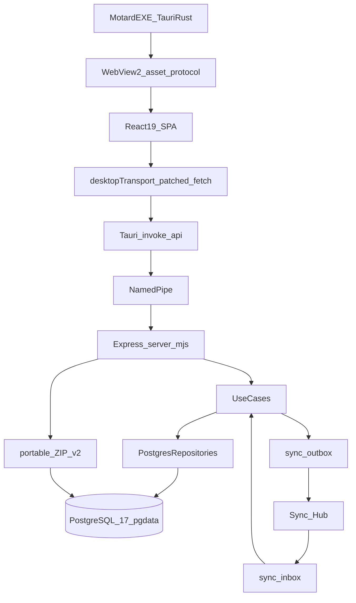
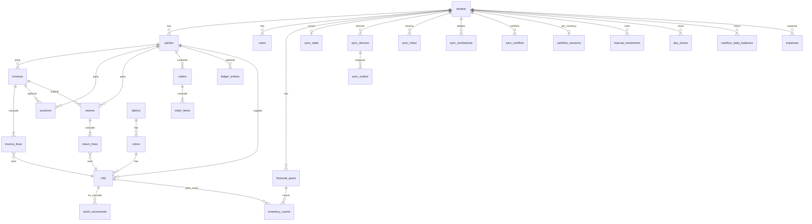
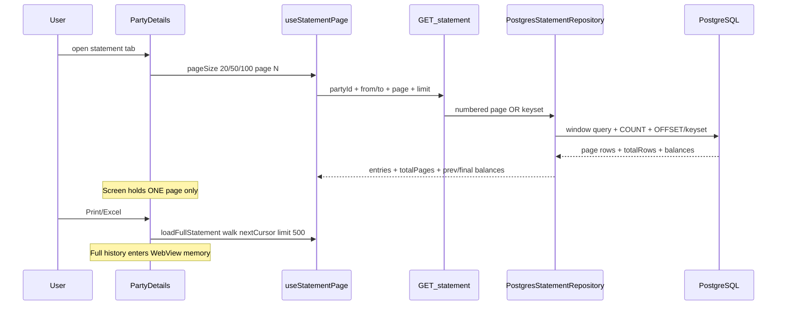
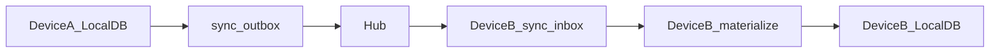
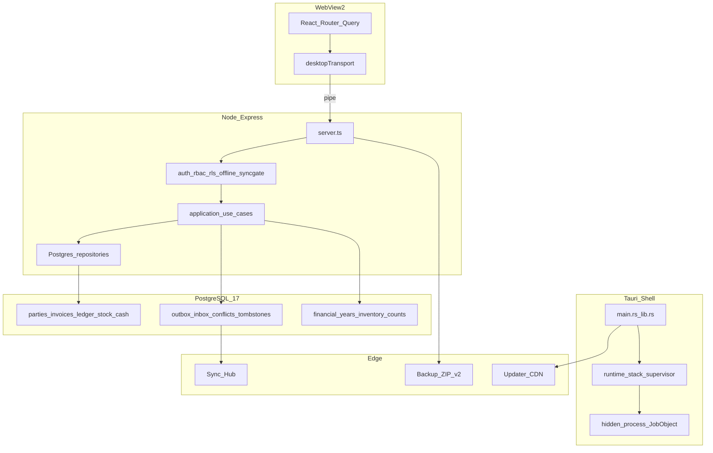
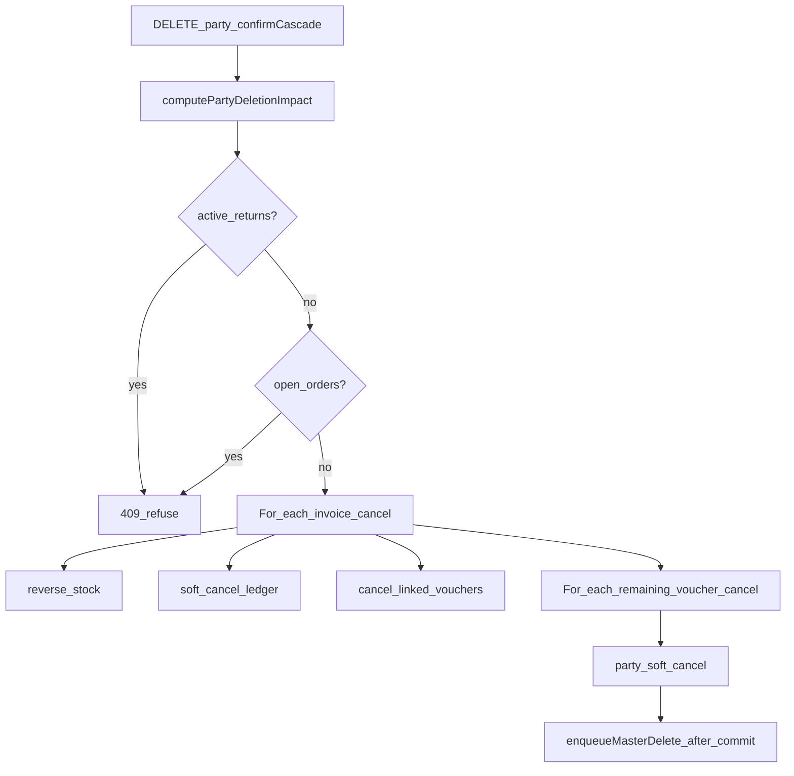
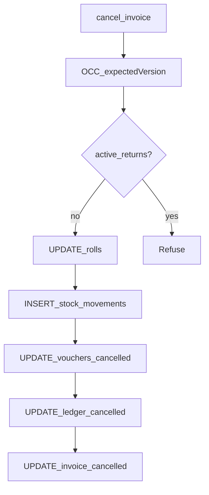
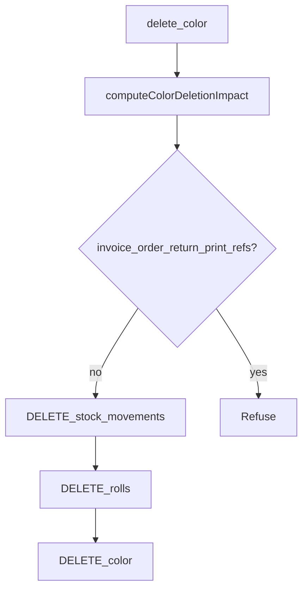

# Motard Fabrics Group ERP — Full System Reverse-Engineering Audit

**Product:** Motard Fabrics Group ERP (`fabric-erp` / `com.motardfabrics.erp`)  
**Audited version:** 1.2.0 (configs)  
**Audit mode:** READ-ONLY analysis — no production code modified  
**Evidence rule:** every material claim tagged `CONFIRMED FROM CODE` | `INFERRED` | `NOT VERIFIED` / `UNKNOWN`  
**Prior docs:** claims in README / `AUDIT-V2-VERIFICATION.md` are treated as unverified until matched to current code.

---

## A. Executive Summary

This is a **desktop-first multi-tenant fabric/roll trading ERP**: local PostgreSQL + Express API + React SPA inside Tauri 2 / WebView2, with optional multi-device sync via Hub outbox/inbox, portable ZIP backup, year closing, and license-gated updates.

**Architecture (actual, not assumed):**

```text
Motard EXE (Tauri/Rust)
  ├── splash / main / recovery WebView2 windows
  ├── Job Object (KILL_ON_JOB_CLOSE)
  ├── postgres (pg_ctl → postmaster)  →  %LOCALAPPDATA%\motard-erp\pgdata
  └── node.exe server.mjs             →  named pipe \\.\pipe\motard-erp
         ↑
React SPA (asset protocol _shell.html)
  → patched fetch("/api") → Tauri invoke("api") → pipe → Express → Drizzle → PG
         ↓
sync_outbox → Hub → sync_inbox (other devices)
```

**Highest confirmed long-term risks (scale / correctness):**

| Risk | Severity | Class |
|------|----------|-------|
| Client `fetchAllPaged` for parties + inventory (and several `all:true` financial lists) | HIGH | CONFIRMED LIMIT / PERF |
| PartyDetails tabs load all invoices/vouchers/returns into WebView | HIGH | CONFIRMED LIMIT / PERF |
| Statement UI is paged; print/Excel walks full history into memory | MEDIUM–HIGH | CONFIRMED LIMIT |
| Invoice cancel / returns do not call day-lock | MEDIUM | CONFIRMED FROM CODE |
| Party cascade sync enqueue is post-commit best-effort | MEDIUM | CONFIRMED FROM CODE |
| Dye purge is sync-exempt + can leave order/return/print residues | HIGH | CONFIRMED LIMIT + UNKNOWN FK matrix |
| Updater configured but `createUpdaterArtifacts: false` | MEDIUM | CONFIRMED LIMIT / PACKAGING |
| Exact Tauri/Rustc patch, live PG_VERSION in tree | — | UNKNOWN |

---

## B. Exact Current Architecture

### B.1 Identity

| Item | Value | Evidence | Class |
|------|-------|----------|-------|
| npm name | `fabric-erp` | root `package.json` | CONFIRMED |
| Product name | Motard Fabrics Group ERP | `desktop/src-tauri/tauri.conf.json` | CONFIRMED |
| App id | `com.motardfabrics.erp` | same | CONFIRMED |
| Version | **1.2.0** | root + desktop + Cargo + tauri.conf | CONFIRMED |
| Backend package | `erp-backend` **0.1.0** | `backend/package.json` | CONFIRMED |
| Shared package | `@erp/shared` 1.0.0 | `packages/shared/package.json` | CONFIRMED |
| Cargo package | `motard-fabrics-erp` | `desktop/src-tauri/Cargo.toml` | CONFIRMED |

### B.2 Stack

| Layer | Technology | Evidence | Class |
|-------|------------|----------|-------|
| Frontend | React **19.2**, TanStack Router, TanStack Query, Tailwind 4, shadcn new-york | root `package.json`, `components.json` | CONFIRMED |
| Backend | **Express 4** | `backend/src/presentation/server.ts`, `backend/package.json` | CONFIRMED |
| ORM | Drizzle ORM + `pg` | `drizzle.config.ts`, `backend/package.json` | CONFIRMED |
| Database | PostgreSQL **17** / pin **17.10** in desktop prune script | `desktop/scripts/prune-postgres.mjs`, BUILD-WINDOWS | CONFIRMED |
| Desktop | Tauri **2** | Cargo.toml `tauri = { version = "2" }` | CONFIRMED |
| Tauri patch | exact 2.x.y | no Cargo.lock in tree | UNKNOWN |
| Rust | edition **2021**; no rust-toolchain.toml | Cargo.toml | CONFIRMED / UNKNOWN pin |
| Node | engines `>=22 <23`; desktop stage pin **22.14.0** | package.json, `stage-node-runtime.mjs` | CONFIRMED |
| Build | Vite (frontend), tsc (backend), Tauri/Cargo (shell) | scripts | CONFIRMED |
| Installer | **NSIS only** (`targets: ["nsis"]`), currentUser | tauri.conf.json | CONFIRMED |
| Sync | Outbox/Inbox + Hub + OCC + tombstones + claims | `syncCoverage.ts`, sync repos | CONFIRMED |
| Auth | JWT HS256 access+refresh (`jose`), Argon2id, PIN, denylist, session cutoff | `JwtSigner.ts`, `auth.route.ts` | CONFIRMED |
| Authorization | RBAC roles: admin / accountant / warehouse / viewer | `rbac.middleware.ts`, `server.ts` guards | CONFIRMED |
| RLS | `enable-rls.sql` + force-RLS migrations; GUC `app.current_tenant_id` | RLS SQL | CONFIRMED |
| Backup | Portable ZIP v2 + desktop scheduler | `portableBackup.ts`, `backupScheduler.ts` | CONFIRMED |
| Update | `tauri-plugin-updater` + CDN `updates.motardfabrics.com`; build artifacts **off** | tauri.conf `createUpdaterArtifacts: false` | CONFIRMED |

### B.3 Architecture Overview (code-derived)



**Doc drift:** `stack.rs` comments still mention SSR / localhost frontend; executable path uses asset protocol + pipe. Class: CONFIRMED FROM CODE (runtime) vs DOCUMENTATION DRIFT (comments).

---

## C. Desktop Runtime

### C.1 Process tree (CONFIRMED)

```text
Motard ERP.exe  (main.rs, windows_subsystem=windows)
├── Job Object JOB_OBJECT_LIMIT_KILL_ON_JOB_CLOSE  (hidden_process.rs)
├── pg_ctl.exe start → postgres.exe (+ workers; job-inherited)
├── node.exe server.mjs  (DesktopStack.server: HiddenChild)
│     listens on \\.\pipe\motard-erp  or  motard-erp-dev
└── WebView2
      ├── splash   (tauri.conf — only window at build)
      ├── main     (created after health OK — _shell.html)
      └── recovery (on supervisor failure — recovery.html)
```

### C.2 Startup sequence

| Stage | File / function | Behavior | Fail | Retry / timeout | Class |
|-------|-----------------|----------|------|-----------------|-------|
| 0 | `main.rs` `main` → `identity::ensure_fresh_installation` | Device binding DPAPI | exit(2) dialog | none | CONFIRMED |
| 1 | Tauri `Builder::default().build` | splash only | exit(4) | none | CONFIRMED |
| 2 | `BootConfig::for_app` | resources, app data, pipe path, db port | exit(5/6) | — | CONFIRMED |
| 3 | background thread `boot_desktop_stack_with_progress` | keeps UI free | exit(3) | — | CONFIRMED |
| 4 | `boot_log::init` | JSON boot.log | best-effort | — | CONFIRMED |
| 5 | `ports::find_free_db_port` | 40000–60000, never 5432 | — | prefer saved; else ≤64 tries | CONFIRMED |
| 6 | `preflight_check` | resource + optional sha256 | BootFailure dialog | none | CONFIRMED |
| 7 | factory reset if flagged | rename pgdata → pgdata.reset-* | — | keep 3 archives | CONFIRMED |
| 8 | `secret_store::load_or_generate` | JWT / master / db password DPAPI | fail boot | — | CONFIRMED |
| 9 | `reap_orphaned_processes` | CIM + taskkill /T /F for this data root | best-effort | — | CONFIRMED |
| 10 | `ensure_pgdata` | reuse / copy template / initdb; stale PID cleanup | fail | — | CONFIRMED |
| 11 | `sync_pg_conf_port` | write real port into postgresql.conf | — | — | CONFIRMED |
| 12 | `start_postgres` | `pg_ctl start -w -t 900` | dialog + abort | **1** retry after stale lock clear; TCP wait **300s** | CONFIRMED |
| 13 | `spawn_server` | node server.mjs + DESKTOP_PIPE + secrets | stop PG + dialog | — | CONFIRMED |
| 14 | `wait_ready` / `pipe::probe_live` | GET `/api/health/live` over pipe | abort_partial_boot | ceiling **20 min** | CONFIRMED |
| 15 | `SupervisorHandle::start` | poll 2s | recovery UI | restarts ≤5, rapid breaker, backoff ≤15s, restart ceiling 300s | CONFIRMED |
| 16 | create main window | `WebviewUrl::App("_shell.html")`; show on PageLoad+healthy; close splash | — | — | CONFIRMED |

**Lifecycle ownership:** Supervisor owns Node handle + restart; Postgres via `pg_ctl`; Job Object kills descendants if parent dies; `HiddenChild` Drop does **not** kill (explicit kill or job). Class: CONFIRMED.

### C.3 Shutdown / crash matrix (summary)

| Event | Behavior | Class |
|-------|----------|-------|
| Normal Exit / ExitRequested | `supervisor.stop()` → Node kill_and_wait(8s) → `pg_ctl stop -m fast` → `process::exit(0)` | CONFIRMED |
| Windows logoff/shutdown | `session_end` WM_* → supervisor.stop() | CONFIRMED |
| Force kill parent / taskkill /F parent | Job Object kills children | CONFIRMED |
| Node crash mid-session | supervisor unhealthy strikes → restart Node; budget then recovery window | CONFIRMED |
| Postgres TCP down | `restart_postgres` + stale lock cleanup | CONFIRMED |
| Power loss | next boot: orphan reaper + stale postmaster.pid classify | CONFIRMED |
| Stale pipe | fixed pipe name; orphans reaped; single-instance plugin | CONFIRMED |
| DB recovery (crash) | PostgreSQL WAL recovery — **app does not add custom crash recovery beyond PG** | INFERRED (standard PG) / NOT VERIFIED for WAL settings |

---

## D. WebView2

| Question | Answer | Class |
|----------|--------|-------|
| How React loads | Asset protocol `_shell.html` (`WebviewUrl::App`) — **not** localhost SPA | CONFIRMED |
| API | Named pipe via `invoke("api")` | CONFIRMED |
| WebView count | splash + main + optional recovery | CONFIRMED |
| Service Worker | `public/sw.js` exists; registered in `__root.tsx` **PROD web only**, **not desktop** | CONFIRMED |
| Workbox | absent | CONFIRMED |
| Giant arrays | `useParties` / `useInventory` module caches via `fetchAllPaged` | CONFIRMED |
| Statement on screen | **one page** (`useStatementPage`); full walk only print/Excel | CONFIRMED |
| Pagination | mixed: server page (invoices/ledger/statement) vs client slice after full fetch (parties/inventory) | CONFIRMED |

### D.1 Page | Hook | Endpoint | Max Rows | Client Memory Risk

| Page | Hook | Endpoint (primary) | Max Rows | Memory Risk |
|------|------|--------------------|----------|-------------|
| `/` Dashboard | `useDashboard` | `/api/dashboard` | summary | LOW |
| `/customers/` | `useParties` | `/api/customers` paged walk | **ALL parties** | **HIGH** |
| `/customers/$id` | PartyDetails + `all:true` lists + `useStatementPage` | invoices/vouchers/returns/statement | all docs for party + 1 stmt page | **HIGH** (tabs) |
| `/suppliers/` | `useParties` | `/api/suppliers` | ALL | **HIGH** |
| `/suppliers/$id` | same as customer detail | same | same | **HIGH** |
| `/inventory` | `useInventory` | fabrics/colors/rolls walk | **ALL** | **HIGH** |
| `/invoices/` | `useInvoicesList` | `/api/invoices` page | page size | LOW–MED |
| `/invoices/sale/new` | inventory+parties | create + masters | ALL masters | **HIGH** |
| `/invoices/entry/new` | same | same | ALL masters | **HIGH** |
| `/invoices/$id` | `useInvoice`, `useVouchersList()` | invoice + vouchers page | 1 + first voucher page | MED |
| `/cashbox` | cashbox + ledger `all:true` + invoice/voucher pulls | `/api/cashbox/*`, `/api/ledger` | **large** | **HIGH** |
| `/ledger` | `useLedgerPage` | `/api/ledger` | page | LOW |
| `/receipts/` `/payments/` | `useVouchersList` paged | `/api/receipts\|payments` | page | LOW |
| `/receipts/new` `/payments/new` | VoucherForm `all:true` invoices | invoices walk | ALL open invoices | **HIGH** |
| `/returns/` | paged | `/api/returns` | page | LOW |
| `/returns/*/new` | ReturnForm + inventory | returns create | masters ALL | **HIGH** |
| `/expenses/` | list (limit risk) | `/api/expenses` | UNKNOWN if uncapped UI | MED / UNKNOWN |
| `/orders/` | `useOrdersList()` no pager | `/api/orders` default ~20 | first page only | MED (truncated list) |
| `/closing` | YearClosingApi keyset sheet | `/api/financial-years/*` | one count page | LOW |
| `/reports/*` | report hooks + parties | reports + parties cache | parties ALL | MED–HIGH |
| `/settings/sync` | sync status | `/api/sync/*` | small | LOW |
| `/settings/backup` | backup | `/api/backup/*` | N/A | LOW |
| `/sync/conflicts` | conflicts | `/api/sync/conflicts` | open set | LOW–MED |
| `/print-center` | static links | — | — | LOW |
| Print send/receive | `usePrintJobs` | printing | **ALL jobs** | MED–HIGH |

Evidence: explore of hooks + `fetchAllPaged.ts` + PartyDetails comments. Class: CONFIRMED for patterns named above.

---

## E. Full Database Schema

### E.1 Inventory counts

- **47** Drizzle `*.table.ts` modules under `backend/src/infrastructure/orm/schemas/`
- **99** journal migrations (`meta/_journal.json` idx 0–98)
- **SQL-only tables (no Drizzle module):** `sync_tombstones`, `sync_conflicts`, `financial_operations`
- **Dropped historically:** `party_balances` (0038) — still named in RLS IF EXISTS

### E.2 Table catalog (complete list)

Legend: Soft = status/cancelled_*; OCC = version column; SyncId = client_operation_id.

| TABLE | Purpose | PK | Key FKs | Soft / Hard | OCC | Money / FX | Sync cols | Notes |
|-------|---------|----|---------|-------------|-----|------------|-----------|-------|
| tenants | company/tenant | id | activation→license_activations SET NULL | status | — | — | license cache jsonb | RLS tenant_directory |
| users | app users | id | tenant | active bool | — | — | tokens_revoked_before | roles varchar |
| schema_migrations | migration versions | version | — | hard | — | — | — | no RLS |
| parties | customers/suppliers | id | tenant | soft cancel | version | opening_balance, credit_limit, currency | — | unique code/name per tenant |
| fabrics | dye/fabric master | id | tenant | hard delete | version | min_stock_kg | — | |
| colors | color under fabric | id | fabric | hard | version | — | — | unique tenant+fabric+name |
| rolls | inventory rolls | id | color, supplier→parties | status in_stock… | version | price/sale_price, currency | — | remaining_kg/pieces |
| invoices | sale/entry docs | id | party NOT NULL | soft | version | totals, paid, FX base_* | client_operation_id | unique tenant+type+number |
| invoice_lines | lines | id | invoice **CASCADE**, fabric/color/roll | owned | — | price/cost 14,4 | — | |
| orders | customer orders | id | customer, fulfilled_invoice | status cancel | version | currency | — | |
| order_items | order lines | id | order **CASCADE** | owned | — | qty | — | |
| vouchers | receipt/payment | id | party, invoice? | soft | version | amount, FX | client_operation_id | |
| ledger_entries | journal | id | party nullable | soft cancel | — | debit/credit, FX, cash_impact | client_operation_id | **append-only trigger** |
| ledger_entry_archive | archived ledger | id | tenant CASCADE, party SET NULL | soft fields | — | same money | — | archive_year |
| yearly_party_summaries | year snapshots | id | party/tenant CASCADE | — | — | opening/closing totals | — | unique tenant+party+year+currency |
| returns | sale/entry returns | id | party, original_invoice | soft | version | FX base_total | client_operation_id | |
| return_lines | return lines | id | return **CASCADE**, roll | owned | — | price | — | unique return+roll |
| cashbox_sessions | opening per currency | id | tenant | — | — | opening_balance | — | unique tenant+currency |
| manual_movements | manual cash | id | tenant | — | — | amount | client_operation_id | triggers daily |
| day_closes | day close snapshot | id | tenant | — | — | expected/counted… | — | unique tenant+date |
| cashbox_daily_balances | daily closing mirror | (tenant,currency,date) | — | trigger-maintained | — | closing_balance | — | no DELETE branch on ledger trigger |
| expenses | expenses | id | tenant | soft | version | amount | client_operation_id | |
| stock_movements | stock audit | id | roll **NO CASCADE** | status | — | — | — | app deletes before roll |
| print_jobs | print send/receive | id | rolls, customer, order, expense? | — | — | cost/charge/FX | — | |
| financial_years | year closing control | id | tenant | status open…closed | — | closing_* jsonb | — | unique tenant+year; no history delete |
| inventory_counts | count sheet | id | roll | status counted…void | — | — | posted_movement_id | unique tenant+year+roll |
| sync_devices | devices | id | registration?, user? | revoke | — | — | fingerprint | |
| sync_device_authorized_users | device↔user | (device,user) | CASCADE both | — | — | — | — | |
| sync_outbox | push queue | id | device? | status | — | payload jsonb | op_id unique, seq, lease | |
| sync_inbox | pull apply | id | — | status | — | payload | op_id, applied_seq trigger | |
| sync_resource_claims | stock claims | id | device | — | — | qty | — | |
| sync_state | pull cursor | tenant_id | — | — | — | — | last_pull_seq | |
| sync_tombstones | deleted masters | id | — | — | deleted_entity_version | — | op_id, deletion_seq | SQL-only; shape reconciled 20261021 |
| sync_conflicts | OCC conflicts | id | — | open/resolved | base/server version nullable | local_intent jsonb | op_id | SQL-only |
| licenses | license keys | id | tenant? | — | — | — | offline_token | platform RLS |
| license_activations | activations | id | license, tenant | — | — | — | — | |
| device_registrations | devices | id | tenant+license | — | — | — | fingerprint | |
| license_audit_events | license audit | bigserial | — | append-only triggers | — | — | — | |
| secrets | encrypted secrets | id | tenant | — | version | — | — | |
| company_profiles | company 1:1 | id | tenant unique | — | — | currency, tax | — | |
| setup_wizard_state | wizard | tenant_id | — | — | — | — | — | |
| server_installations | install id | id | — | — | — | — | — | |
| system_admins | platform admins | id | — | — | — | — | — | no tenant; platform_only RLS |
| invitation_codes | invites | id | license | — | — | — | — | |
| document_sequences | doc numbers | id | tenant | — | — | — | — | |
| document_number_blocks | sync number blocks | id | sync_device | — | — | — | — | |
| attachments | files meta | id | polymorphic | — | — | — | — | |
| audit_logs | audit | bigserial | — | — | — | snapshots jsonb | — | fire-and-forget |
| notifications | user notes | id | user | — | — | — | — | |
| settings | tenant settings | id | tenant unique | — | — | currencies jsonb | — | |
| idempotency_keys | HTTP idem | bigserial | — | expires | — | — | — | |
| revoked_tokens | JWT denylist | jti | — | — | — | — | — | **no RLS** |
| financial_operations | financial op keys | id | — | — | — | — | operation_key | SQL-only + RLS |

**Append-only / triggers (CONFIRMED):**

| Trigger | Table | Role |
|---------|-------|------|
| `trg_ledger_entries_append_only` | ledger_entries | block DELETE; UPDATE only cancel (or party remap GUC) |
| `cashbox_daily_*` | ledger + manual_movements | maintain cashbox_daily_balances (no ledger DELETE branch) |
| `trg_sync_inbox_applied_seq` | sync_inbox | stamp applied_seq |
| license_audit no update/delete | license_audit_events | append-only |

**Default FK:** NO ACTION unless noted CASCADE/SET NULL. Class: CONFIRMED from schemas + migrations inventory.

### E.3 Core relationship chains

```text
tenants
 └─ parties
      ├─ invoices ──CASCADE── invoice_lines → fabrics/colors/rolls
      ├─ vouchers (optional invoice_id)
      ├─ returns ──CASCADE── return_lines → rolls
      ├─ orders ──CASCADE── order_items
      ├─ ledger_entries (nullable party; polymorphic reference_*)
      ├─ yearly_party_summaries
      └─ rolls.supplier_id
 rolls ← stock_movements (NO cascade)
 rolls ← inventory_counts
 financial_years (tenant/year) — snapshots only
 cashbox_* ← triggers from ledger/manual
 sync_* ← devices / outbox / inbox / tombstones / conflicts
```

---

## F. Full ERD



**Arabic cascade narrative (CONFIRMED):**

- **حذف/إلغاء عميل (cascade):** يُرفض إن وُجدت مرتجعات نشطة أو طلبات مفتوحة → إلغاء كل الفواتير المرتبطة (عكس مخزون+دفتر+سندات مرتبطة) → إلغاء السندات المتبقية → soft-cancel للـ party. القيود المحاسبية تُلغى soft ولا تُحذف. رصيد الافتتاح في ledger **لا يُعكس**. Sync: enqueue حذف party بعد الـ commit (best-effort).
- **إلغاء فاتورة:** يرفض إن وُجدت مرتجعات نشطة؛ يعيد/يعكس المخزون؛ يلغي vouchers المرتبطة بـ invoice_id؛ soft-cancel ledger؛ **لا** day-lock.
- **حذف لون:** يُرفض إن وُجدت مراجع في فواتير/طلبات/مرتجعات/طباعة؛ وإلا يحذف stock_movements ثم rolls ثم color.
- **Dye purge:** hard DELETE سلسلة واسعة + إسقاط مؤقت لـ append-only trigger + إعادة بناء daily balances؛ sync-exempt.

---

## G. Page → Hook → API → Repository → Table Map

| PAGE | HOOKS | API | USE CASE / REPO | TABLES (R/W) |
|------|-------|-----|-----------------|--------------|
| `/` | useDashboard | GET /dashboard | dashboard use-cases / repos | aggregates invoices, ledger, cashbox, parties (R) |
| `/login` | useCurrentUser / auth | /api/auth/* | JwtSigner, user repo | users, revoked_tokens (W login) |
| `/customers/` | useParties | /api/customers | party list | parties (+ list stats ledger/invoices) R |
| `/customers/$id` | PartyDetails, statement, all lists | /customers/:id, statement, invoices… | party, statement, invoice, voucher, return repos | parties, invoices, voucher, returns, ledger R; settle/delete W |
| `/suppliers/` `$id` | same pattern | /api/suppliers | same | same |
| `/inventory` | useInventory, dye purge | /inventory/*, dye purge | fabric/color/roll/dye repos | fabrics, colors, rolls, stock_movements W |
| `/invoices/` | useInvoicesList | /invoices | invoice repo | invoices R |
| `/invoices/sale/new` | useInvoices, inventory, parties | POST /invoices | createInvoice → PostgresInvoiceRepository | invoices, lines, rolls, stock_movements, ledger, vouchers?, sequences, sync_outbox |
| `/invoices/entry/new` | same | POST /invoices | same entry path | same + notifications? |
| `/invoices/$id` | useInvoice, cancel | GET/cancel | cancelInvoice | cancel path tables |
| `/invoices/tracking` | useDocumentTrack | document-track | track repo | multi-doc R |
| `/receipts/` `/payments/` | useVouchersList | /receipts|/payments | voucher repo | vouchers R |
| `/receipts/new` `/payments/new` | VoucherForm | POST | createVoucher | vouchers, ledger, invoices.paid?, sync_outbox |
| `/returns/` | useReturnsList | /returns | return repo | returns R |
| `/returns/*/new` | ReturnForm | POST /returns | createReturn | returns, lines, rolls, stock, ledger, sync_outbox |
| `/expenses/` `new` | useExpenses | /expenses | expense repo | expenses, ledger, sync_outbox |
| `/orders/` `$id` `new` | useOrders | /orders | order repo | orders, items |
| `/cashbox` | useCashbox*, ledger all | /cashbox/*, /ledger | cashbox + ledger repos | sessions, manual, day_closes, daily_balances, ledger R/W |
| `/ledger` | useLedgerPage | /ledger | ledger repo | ledger_entries R |
| `/closing` | YearClosingApi | /financial-years/* | financialYear + inventoryCount repos | financial_years, inventory_counts, stock, ledger (post), yearly_party_summaries |
| `/reports` `$slug` | useReports | /reports/* | report repos | multi R |
| `/settings/*` | useSettings | /settings, company, users, backup, sync | settings/user/backup/sync | settings, company_profiles, users, backup files |
| `/sync/conflicts` | useSyncConflicts | /sync/conflicts | syncConflicts | sync_conflicts |
| `/print-center` | — | — | — | — |
| print send/receive | usePrintJobs | /printing/* | print repos | print_jobs, rolls, expenses?, ledger? |

Full route list: `src/routeTree.gen.ts` (CONFIRMED).

---

## H. Business Data Flows

Shared facts (CONFIRMED): cashbox balance is **ledger-derived** (`cash_impact`) + daily mirror; sync enqueue usually same tenant tx as mutation; audit_logs often fire-and-forget.

### H.1 Create sale invoice

```text
UI invoices.sale.new → useInvoices.create → POST /invoices
→ createInvoiceUseCase → PostgresInvoiceRepository.create
→ TABLES: document_sequences/blocks, invoices, invoice_lines, rolls↓, stock_movements(out),
           ledger (sales_invoice/sales_revenue + optional COGS legs),
           optional vouchers(receipt)+ledger cash in if paid
→ CASH: only if paid+cash (day-lock); else none
→ SYNC: sync_outbox invoice create
→ AUDIT: best-effort
```

### H.2 Create purchase/entry invoice

Same route; stock **in**; ledger purchase_invoice + inventory_asset; paid → payment voucher + cash out + balance check.

### H.3–H.6 Settle / receipt / payment / expense

- **تسديد على فاتورة:** غالباً عبر voucher مربوط `invoice_id` يحدّث `invoices.paid` + ledger.
- **قبض:** POST /receipts → vouchers + ledger receipt_in / cash; day-lock always.
- **دفع:** POST /payments → payment_out / cash out + sufficient balance.
- **مصروف:** expenses + ledger expense/cash; day-lock.

### H.7 Return

POST /returns → returns + lines + roll adjust + stock_movements + ledger (sales_return / purchase_return + COGS reverse for sale). **No day-lock in return repo.** CashImpact none.

### H.8–H.10 Inventory add/consume/adjust

- Add: entry invoice or roll create + stock_movements.
- Consume: sale invoice / entry return.
- Adjust: inventory count post → stock_movements + ledger (`cashImpact: none`); year-closing path.

### H.11 Cancel invoice

POST /invoices/:id/cancel → OCC; block if active returns; reverse stock; cancel linked vouchers; soft-cancel ledger; soft-cancel invoice. **No day-lock / year re-check on cancel.**

### H.12–H.13 Delete customer/supplier

See §F / purgePartyCascadeUseCase. Non-cascade refuses if active docs remain.

### H.14 Delete color

rollDeletionHelper impact → cleanup movements → delete rolls → delete color.

### H.15–H.16 Year count / close

begin-counting → count-sheet keyset → counts → post variances → close (confirm `"إقفال"`) writes snapshots; **does not delete/archive live ledger**. Reopen admin-only. Sync: year-close routes **exempt**; devices converge by pulling `financial_years` state (per syncCoverage comments).

### H.17–H.18 Backup / Restore

POST /api/backup/full|verify|restore → portable ZIP v2 NDJSON per tenant table (device-bound tables excluded) → staging verify → swap tx. Scheduler auto ZIPs on desktop. Factory reset = rename pgdata (Tauri), not ZIP restore.

### H.19–H.21 Sync push / pull / conflict

Local mutation → outbox → hub push → other device inbox → materialize (OCC baseVersion) → conflict record if stale → resolve keep-server|rebase|withdraw. Tombstones block recreate.

### H.22 Update application

`check_desktop_update` / `install_desktop_update` after license allows; CDN latest.json. **Build does not emit updater artifacts** (`createUpdaterArtifacts: false`) — shipping pipeline UNKNOWN.

---

## I. Financial Integrity

| Figure | Computed vs Stored | Where | Class |
|------|-------------------|-------|-------|
| Customer/Supplier live balance | **Computed** SUM(debit−credit) active ledger (supplier sign flip) | PostgresLedgerRepository.getBalance | CONFIRMED |
| parties.opening_balance | **Stored** + posted as ledger on create; edit refused later | PostgresPartyRepository | CONFIRMED |
| Customer credit | **Computed** never stored | customerCredit.ts | CONFIRMED |
| Cashbox live | Prefer **stored** cashbox_daily_balances; else recompute opening+ledger cash+manual | cashboxBalanceHelper | CONFIRMED |
| Day close expected | Recomputed at close; snapshot stored | day_closes | CONFIRMED |
| Statement prev/final | **Computed** from ledger window | PostgresStatementRepository | CONFIRMED |
| Yearly party summary | **Stored snapshot** at close; live still continuous ledger | financialYearRepository | CONFIRMED |
| Profit | salesRevenue − COGS − expenses | PostgresProfitRepository / Profit.ts | CONFIRMED |
| COGS | Prefer posted cogs_expense ledger; else Σ(qty×cost_per_kg snapshot) | profit repo + invoice create | CONFIRMED |
| FX / base_* | Frozen on docs + ledger legs | invoice/voucher/ledger columns | CONFIRMED |
| EUR | settings currencies jsonb may allow; default SYP | settings / party currency | PARTIAL — EUR-specific flows NOT VERIFIED as first-class |

**Double-count / stale risks (CONFIRMED LIMIT or CODE):**

- Writing a new “opening” ledger row at year close would double-count — code **explicitly avoids** this.
- `party_balances` cache removed — good; list stats still recomputed (stale UI if client cache not invalidated).
- Client full caches (`useParties`/`useInventory`) can show stale until invalidation.
- Cancel without day-lock can alter cash history on closed days.
- Dye purge rebuilds daily balances because DELETE trigger gap.

---

## J. Statement / Historical Data (50k invoices scenario)

### J.1 Path



### J.2 Answers for محمد خالد 2026–2030

| Question | Answer | Class |
|----------|--------|-------|
| Does WebView receive all history on screen? | **No** — one page | CONFIRMED |
| Does print/Excel? | **Yes** — cursor walk into memory | CONFIRMED |
| Balance from all data? | prevBalance / finalBalance computed over **full window** (not just page) | CONFIRMED |
| Pagination hide data? | Hides from **display**; totals still from full window | CONFIRMED |
| Cap? | default limit 200, max **500** per request | CONFIRMED |
| Cap cause error? | Not error — more requests for full export | CONFIRMED |
| Incomplete result? | Server returns **empty page** if page index past end (no silent last-page remap); client clamps display via `clampStatementPageIndex` | CONFIRMED |
| OFFSET at 100k rows? | Numbered page uses OFFSET inside party window — **RISK** at very large windows | CONFIRMED LIMIT / PERF |
| Keyset available? | Yes (`date|createdAt|id`) | CONFIRMED |
| Indexes | party/date/currency ledger indexes + keyset migration 20261015 | CONFIRMED |

Evidence: `PostgresStatementRepository.ts`, `statementPaging.ts`, `useStatement.ts`, PartyDetails comments, `statement-page-clamp.test.ts`.

---

## K. Inventory

- Masters: fabrics → colors → rolls (remaining_kg/pieces, prices).
- Movements: append-style `stock_movements`; FK to roll **blocks** hard delete until cleaned.
- Sale decreases; entry increases; returns reverse; count post writes variance movement + non-cash ledger.
- Client holds **all** rolls in memory via `useInventory` — primary scale bottleneck for inventory UI.

---

## L. Cashbox

- Sessions store **opening** per currency.
- Live balance: daily mirror table preferred; else SQL recompute.
- Manual movements + ledger cash_impact feed triggers → `cashbox_daily_balances`.
- Day close stores expected/counted snapshot.
- UI `/cashbox` currently pulls heavy lists (`all:true`) — performance risk separate from DB correctness.

---

## M. Delete / Cascade Safety

| Entity | Blocks | Does | Orphans? | Ledger | Cash | Stock | Sync | OCC |
|--------|--------|------|----------|--------|------|-------|------|-----|
| Customer/Supplier cascade | active returns, open orders | cancel invoices→vouchers→soft party | soft rows remain | soft cancel via invoice/voucher | via cancel | via invoice cancel | party delete enqueue after commit | version check |
| Invoice cancel | active returns, OCC, credit edge cases | soft cancel + reverse stock + cancel linked vouchers | soft | soft cancel | via cash legs cancel | reverse | invoice cancel unit | yes |
| Color | doc refs | delete movements→rolls→color | none if gate ok | n/a | n/a | delete movements | color delete | version |
| Roll | via color helper / refs | delete movements then roll | — | n/a | n/a | delete | roll delete | version |
| Voucher cancel | day-lock on create path; cancel path per voucher repo | soft + ledger cancel + invoice.paid adjust | soft | soft | yes | none | voucher cancel | yes |
| Return | — | soft cancel path (separate) | soft | soft | none on create | reverse | return cancel | yes |
| Dye purge | UI warns otherBlocked; server may 409 | hard delete chain | possible if FK not hit | hard delete (trigger dropped temporarily) | daily rebuild | hard | **exempt** | n/a |

Transactions: party cascade / invoice create / dye purge use tenant transactions. Class: CONFIRMED for behaviors cited; dye leftover FK matrix UNKNOWN without live exercise.

---

## N. Year Closing / Long-term Data

| Question | Answer | Class |
|----------|--------|-------|
| Old data deleted? | **No** on close | CONFIRMED |
| Archive? | `ledger_entry_archive` / yearly summaries exist; close writes snapshots; continuous ledger remains source of live balance | CONFIRMED |
| Statement after 4 years? | Can query historical ledger if not purged; UI paging required | CONFIRMED capability / PERF RISK |
| Opening balance double? | Close deliberately avoids posting new opening ledger rows | CONFIRMED |
| Reopen? | Admin + reason; year status reopened | CONFIRMED |
| Sync of close? | Exempt; hub-authoritative financial_years | CONFIRMED |

---

## O. Sync Deep Analysis



| Topic | Behavior | Class |
|-------|----------|-------|
| What syncs | Routes in syncCoverage with `{sync:…}` — invoices, vouchers, returns, orders, expenses, parties, inventory, ledger, cashbox, settings, users (subset), print, settlements | CONFIRMED |
| What does not | Year close ops, dye purge, auth sessions, hub pairing, integrity admin, some numbering transport | CONFIRMED |
| opId | UUID; often HTTP Idempotency-Key; unique per tenant outbox/inbox | CONFIRMED |
| Cursor | `sync_state.lastPullSeq` / applied_seq | CONFIRMED |
| OCC | baseVersion on update/cancel; conflict else | CONFIRMED |
| Conflict resolve | keep-server / rebase / withdraw — **no auto LWW** on financial docs | CONFIRMED |
| Tombstone | blocks recreate | CONFIRMED |
| Offline writes | admin/accountant only when offline mode | CONFIRMED |

**Offline dual-edit scenario (Device A creates invoice offline; Device B edits same customer; both online):**

1. A's invoice create materializes on B via inbox (new entity — no OCC clash on invoice id).
2. B's party update carries baseVersion; if A also changed party, second apply hits OCC → **sync_conflicts** open — operator resolves. Class: CONFIRMED mechanism; exact UI/operator timing NOT VERIFIED in live multi-device run here.
3. Party cascade delete enqueue post-commit gap: remote may miss party delete unit if enqueue fails (logged) — CONFIRMED risk.

---

## P. Backup / Restore

| Stage | Behavior | Class |
|-------|----------|-------|
| Backup | ZIP v2: manifest+sha256, NDJSON tables with tenant_id except DEVICE_BOUND | CONFIRMED |
| Verify | Staging DB restore check | CONFIRMED |
| Restore | confirm replace → single swap tx | CONFIRMED |
| Scheduler | desktop after 02:00 / stale>24h; keep 7; Documents mirror | CONFIRMED |
| Factory reset | archive pgdata.reset-*; not backup ZIP | CONFIRMED |
| User restore ≠ pg_restore of Motard ZIP | HTTP portable path | CONFIRMED |

**Data-loss scenarios:** wrong factory reset; interrupted restore mid-swap (depends on tx — CONFIRMED design intends atomic swap; crash mid-tx → PG rollback INFERRED); restore into mismatched app version without migrations — RISK / NOT VERIFIED all combos; device-bound tables excluded → re-pair needed UNKNOWN UX completeness.

---

## Q. Update / Installer / Packaging

### Q.1 Shipped resources (manifest v3 required)

postgres.exe, pg_ctl, initdb, pg_dump, pg_restore, libpq.dll, pgdata-template, node.exe, server.mjs, pino/thread-stream workers, `_shell.html`/`index.html`, migrations journal, argon2 native, license-public.pem.

Missing → build validate fail and/or runtime `preflight_check` fatal Arabic dialog.

### Q.2 `libintl-9.dll was not found`

- **No special-case** for libintl in desktop scripts (grep absent).
- Prune keeps DLLs discovered via **PE imports** of bin exes (+ ICU generation).
- If a dependency is not imported statically / pruned away / AV quarantined → Windows error **0xC0000139** / missing DLL dialog; postgres may fail start or backends die. Class: **INFERRED** packaging failure mode from prune/validate comments; specific libintl not named in repo → NOT VERIFIED as currently required.

### Q.3 Update

Updater pubkey + endpoint configured; license gate in Rust commands; **`createUpdaterArtifacts: false`** → this build config does not produce updater bundles. Class: CONFIRMED LIMIT.

### Q.4 After 4 years update

Existing `%LOCALAPPDATA%\motard-erp\pgdata` reused if identity/meta match; migrations run via bundled journal; schema fingerprint checks exist in backend. Failure modes: migration fail → boot recovery; incompatible major PG → packaging pin 17.x expected; secrets DPAPI device-bound. Class: CONFIRMED design paths; live 4-year upgrade NOT VERIFIED.

---

## R. Windows Failure Scenarios

| # | Scenario | User symptom | Root cause | Recovery | Data safety | Class |
|---|----------|--------------|------------|----------|-------------|-------|
| 1 | Normal shutdown | clean exit | ExitRequested→supervisor.stop | — | safe if stop completes | CONFIRMED |
| 2 | Restart | same | session_end / ExitRequested | next boot | safe | CONFIRMED |
| 3 | Sleep | UNKNOWN freeze/pipe | OS suspend | resume / restart stack | UNKNOWN | UNKNOWN |
| 4 | Hibernate | similar | OS | same | UNKNOWN | UNKNOWN |
| 5 | Power loss | unclean | no flush guarantee beyond PG | orphan reaper + stale PID + PG WAL | PG durable if fsync default | INFERRED WAL |
| 6 | Force shutdown | unclean | kill | same as 5 | same | CONFIRMED cleanup paths |
| 7 | taskkill /F app | children die | Job Object | reaper next boot | in-flight tx lost | CONFIRMED |
| 8 | App crash | recovery or exit | Rust panic/crash | recovery window / reboot | depends | CONFIRMED supervisor |
| 9 | Node crash | recovery/restart | child exit | supervisor restart ≤budget | last tx | CONFIRMED |
| 10 | PG crash | TCP fail | postmaster die | restart_postgres | WAL | CONFIRMED |
| 11 | WebView2 crash | blank UI | WV process | recreate window UNKNOWN completeness | DB ok | PARTIAL |
| 12 | AV quarantine | missing DLL/exe | quarantine | restore file / exclude | risk | INFERRED |
| 13 | missing DLL | boot fail dialog | preflight / loader | reinstall | data intact | CONFIRMED preflight |
| 14 | damaged db | start fail | corrupt files | restore ZIP / reset | loss if no backup | CONFIRMED options |
| 15 | stale port | bind issues | port file | re-resolve 40000–60000 | ok | CONFIRMED |
| 16 | stale pipe | connect fail | dead listener | reap + respawn | ok | CONFIRMED |
| 17 | stale PID | PG won't start | postmaster.pid | classify + cleanup | ok | CONFIRMED |
| 18 | old PG major | won't open cluster | major mismatch | reinstall/migrate UNKNOWN auto | HIGH risk | INFERRED |
| 19 | update interrupted | half install | NSIS mid-fail | repair/reinstall | pgdata usually kept | INFERRED |
| 20 | uninstall/reinstall | app gone | NSIS | pgdata may remain in AppData | often kept | NOT VERIFIED hooks detail |
| 21 | backup restore | data replaced | portable restore | verify first | replace intentional | CONFIRMED |
| 22 | old EXE | schema mismatch | version skew | migrate / fingerprint fail | risk | INFERRED |
| 23 | Dev+Prod together | two stacks | motard-erp vs motard-erp-dev paths/pipes | use separate | ok if separate | CONFIRMED path split |

---

## S. Performance at Scale

| Scale | Parties cache | Inventory cache | Statement page | Statement export | Invoice list | Party detail tabs | Cashbox all:true |
|-------|---------------|-----------------|----------------|------------------|--------------|-------------------|------------------|
| 10k inv | SAFE–RISK if many parties | RISK if many rolls | SAFE | RISK | SAFE | RISK | RISK |
| 50k | RISK | RISK | SAFE page / RISK OFFSET deep pages | HIGH | SAFE | HIGH | HIGH |
| 100k | HIGH | HIGH | OFFSET RISK | HIGH | SAFE | CRITICAL UI | CRITICAL UI |
| 300k–1M | CRITICAL client | CRITICAL | OFFSET + COUNT cost | CRITICAL WebView | SAFE if paged | CRITICAL | CRITICAL |

| Point | Rating | Why |
|-------|--------|-----|
| Keyset ledger/statement | SAFE design | indexes + keyset exist |
| Numbered OFFSET statement | RISK | deep pages scan |
| COUNT for totalPages | RISK at huge windows | per request |
| fetchAll parties/inventory | RISK→CRITICAL | WebView RAM |
| Server paged invoices | SAFE | page API |
| Report aggregations | UNKNOWN cost | need EXPLAIN on prod sizes |
| Node memory | RISK with large sync payloads | INFERRED |
| PG memory | UNKNOWN | not measured |

Class mixes CONFIRMED (code shape) + INFERRED (absolute timings not measured).

---

## T. Risk Register

| ID | Item | Severity | Type |
|----|------|----------|------|
| R1 | Client fetch-all parties/inventory | HIGH | PERFORMANCE RISK / CONFIRMED LIMIT |
| R2 | PartyDetails `all:true` financial tabs | HIGH | PERFORMANCE RISK / CONFIRMED LIMIT |
| R3 | Cashbox ledger `all:true` | HIGH | PERFORMANCE RISK |
| R4 | Statement export full walk in WebView | HIGH at 50k+ | PERFORMANCE RISK |
| R5 | Invoice cancel skips day-lock | MEDIUM | CONFIRMED LIMIT / ARCHITECTURAL RISK |
| R6 | Returns skip day-lock | MEDIUM | CONFIRMED LIMIT |
| R7 | Party cascade sync enqueue best-effort | MEDIUM | CONFIRMED LIMIT |
| R8 | Dye purge sync-exempt + otherBlocked soft | HIGH | ARCHITECTURAL RISK / UNKNOWN |
| R9 | Updater artifacts disabled in conf | MEDIUM | PACKAGING RISK |
| R10 | Doc comments SSR/localhost drift | LOW | DOCUMENTATION DRIFT |
| R11 | sync.route comment vs transportGuard rbac mismatch | LOW–MED | DOCUMENTATION DRIFT |
| R12 | Sleep/hibernate pipe behavior | MEDIUM | UNKNOWN |
| R13 | Exact Tauri patch / rustc pin | LOW | UNKNOWN |
| R14 | libintl not named in prune | LOW–MED | UNKNOWN / PACKAGING |
| R15 | Orders list silently truncated ~20 | MEDIUM | CONFIRMED LIMIT / UX |
| R16 | Append-only ledger vs dye purge drop trigger | HIGH ops risk | CONFIRMED LIMIT (intentional but dangerous) |

---

## U. Missing Tests (gaps vs flows)

Present (examples): statement-page-clamp, year-closing, party-delete-*, dye-purge-cash-legs, sync-coverage, process-guard, local-access, schema-fingerprint-committed.

**Gaps / weaker coverage (TEST GAP — not claiming zero tests everywhere):**

- Live multi-device OCC conflict UX end-to-end under load — NOT VERIFIED here
- Statement OFFSET performance at 100k+ — no scale benchmark found
- WebView memory / fetchAll regression tests — absent as measured suite
- Sleep/hibernate recovery — absent
- Updater artifact pipeline — conf disables artifacts
- Cancel+day-lock policy tests — cancel explicitly unlocked
- Dye purge all FK residue matrices — partial (`otherBlocked`)

---

## V. Unknowns

1. Exact Tauri/Rustc versions (no lock/toolchain file).
2. Sleep/hibernate named-pipe behavior.
3. Whether every dye-purge leftover FK always fail-closes on all schema versions.
4. Production hub topology (cloud vs desktop-as-hub).
5. Uninstall NSIS exact data retention.
6. Whether EUR is fully supported as operational currency beyond settings storage.
7. Live WebView2 crash auto-recreate completeness.
8. Measured timings/memory at 100k+ (not in-repo).
9. Whether batch1 `sync_tombstones.deleted_at` still exists on old DBs pre-reconcile.
10. Full post-restore hub re-pair UX.

---

## W. Final Architecture Diagram + Master Map



| Layer | Does | Key files | Top risks | Depends on | Depended by |
|-------|------|-----------|-----------|------------|-------------|
| Tauri | boot, windows, spawn, supervise, updates | main.rs, stack.rs, supervisor.rs | boot fail, updater artifacts | resources, Job Object | WebView |
| WebView2 | render SPA | tauri windows | memory from large JSON | asset protocol | user |
| React | UI, RQ caches | src/routes, hooks | fetchAll | transport | — |
| Transport | fetch→invoke→pipe | desktopTransport, tauri-bridge | pipe down | supervisor healthy | React |
| Express | HTTP API | server.ts, routes | auth/RBAC mistakes | PG | clients |
| Use cases | business rules | application/use-cases | sync exemptions | repos | routes |
| Repos | SQL/tx | infrastructure/repositories | cancel locks | Drizzle/PG | use cases |
| PostgreSQL | durability, RLS, triggers | pgdata, migrations | scale OFFSET, corrupt | disk | all |
| Sync | multi-device | sync* | OCC/conflicts/exemptions | hub | devices |
| Backup | ZIP portable | portableBackup | bad restore | disk | ops |

---

## X. Recommended Next Investigation Order

**Analysis only — no fixes implied:**

1. Measure PartyDetails + inventory + cashbox payload sizes on a 10k/50k fixture (MEASURED).
2. EXPLAIN ANALYZE statement OFFSET vs keyset at 100k ledger rows for one party.
3. Trace cancel/day-lock product intent vs code (policy decision, not assumed bug).
4. Live dye-purge FK matrix on DB with orders/returns/print jobs.
5. Multi-device lab: offline invoice + concurrent party edit → conflict UI.
6. Confirm updater CI actually publishes artifacts despite conf flag.
7. Sleep/hibernate pipe soak test on Windows 10/11.
8. Compare `docs/AUDIT-V2-VERIFICATION.md` claims line-by-line to this audit (doc drift).

---

## Evidence index (primary)

| Area | Paths |
|------|-------|
| Identity | `package.json`, `desktop/src-tauri/Cargo.toml`, `tauri.conf.json` |
| Boot | `desktop/src-tauri/src/main.rs`, `runtime/stack.rs`, `supervisor.rs`, `hidden_process.rs`, `ports.rs`, `pipe.rs` |
| Transport | `src/infrastructure/http/desktopTransport.ts`, `tauri-bridge.ts`, `router.tsx` |
| API | `backend/src/presentation/server.ts`, `*.route.ts` |
| Schema | `backend/src/infrastructure/orm/schemas/*`, `migrations/meta/_journal.json`, `rls/enable-rls.sql` |
| Invoice/voucher/return | `PostgresInvoiceRepository.ts`, `PostgresVoucherRepository.ts`, `PostgresReturnRepository.ts` |
| Party delete | `purgePartyCascadeUseCase.ts`, `partyDeletionImpact.ts` |
| Statement | `PostgresStatementRepository.ts`, `statementPaging.ts`, `useStatement.ts` |
| Sync | `syncCoverage.ts`, `syncUseCases.ts`, `syncMaterialize.ts`, outbox/inbox repos |
| Backup | `portableBackup.ts`, `backup.route.ts`, `backupScheduler.ts` |
| Year | `year-closing.route.ts`, `financialYearRepository.ts` |
| Packaging | `resource-manifest.json`, `prune-postgres.mjs` |

---

## Appendix Y — Delete dependency trees (CONFIRMED)

### Y.1 Party cascade delete



### Y.2 Invoice cancel



### Y.3 Color delete



---

## Appendix Z — Sync coverage cheat sheet (CONFIRMED from syncCoverage.ts)

**Synced entityTypes:** invoice, voucher, return, order, expense, print, party, fabric, color, roll, ledger, settlement, cashbox, settings, company, user  

**Exempt (selected):** financial-years begin/close/reopen/counts/post; dye purge; parties/merge; integrity admin; hub pairing; sync transport; auth sessions; license activate/heartbeat; setup wizard; notifications local; company logo; number-blocks transport  

---

## Appendix AA — Quick answers index

| Question | Where in this doc |
|----------|-------------------|
| هذه الصفحة أي جدول؟ | §G + §D.1 |
| هذا الرقم من أين؟ | §I |
| إذا حذفت سجل ماذا يتأثر؟ | §M + Appendix Y + §F |
| 300 ألف فاتورة أين الاختناق؟ | §S + §D.1 (fetchAll / PartyDetails / cashbox / statement export) |
| طفى Windows فجأة؟ | §C.3 + §R rows 5–7 |
| Update بعد 4 سنوات أين القاعدة؟ | §Q.4 + §P factory reset vs pgdata AppData |
| جهازان offline كيف المزامنة؟ | §O |

---

## Appendix AB — Doc vs code contradictions found

| Claim location | Claim | Code reality | Class |
|----------------|-------|--------------|-------|
| `stack.rs` comments | SSR frontend / localhost health | Asset `_shell.html` + pipe `/api/health/live` | DOCUMENTATION DRIFT |
| `stages.rs` comments | OS-assigned port / port file for server | Named pipe; DB port file only | DOCUMENTATION DRIFT |
| `sync.route.ts` comment (~all four roles transport) | all roles keep transport | `transportGuard: rbac(["admin","accountant"])` in server.ts | DOCUMENTATION DRIFT |
| `party_balances` in enable-rls.sql | policy IF EXISTS | table dropped in 0038 | intentional idempotent leftover |
| Prior AUDIT-V2 “fixed” claims | various | re-verify each vs current code — not trusted here | NOT VERIFIED as truth |

---

*End of audit document. Production code unchanged.*
